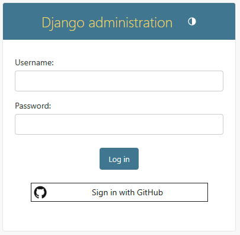

# Quick Setup

## Setup Django Settings

To add this package in your Django Project, please modify the `INSTALLED_APPS` in your `settings.py`:

```python
# settings.py

INSTALLED_APPS = [
    # other django apps
    "django.contrib.messages",  # Need for Auth messages
    "django_github_sso",  # Add django_github_sso
]
```

## Setup GitHub OAuth App

Navigate to `https://github.com/organizations/<YOUR ORGANIZATION>/settings/applications`, then select or create a new
`Org OAuth App`. In this tutorial we will create a new App.

In the field _Authorization callback URI_ add the address: `https://your-domain.com/github_sso/callback/`
replacing `your-domain.com` with your real domain (and Port). For example, if you're running locally, you can
use `http://localhost:8000/github_sso/callback/`.

!!! tip "Do not forget the trailing slash!"


With this, you can retrieve your `Client ID`. For the `Client Secret` please generate a new secret clicking on button `Generate a new client secret`:


## Configuring your Django Project

After that, add the credentials in your `settings.py` file:

```python
# settings.py
GITHUB_SSO_CLIENT_ID = "your Application (client) Id here"
GITHUB_SSO_CLIENT_SECRET = "your client secret value here"
```

Don't commit this info in your repository.
This permits you to have different credentials for each environment and mitigates security breaches.
That's why we recommend you to use environment variables to store this info.
To read this data, we recommend you to install and use a [Twelve-factor compatible](https://www.12factor.net/) library
in your project.

For example, you can use our project [Stela](https://github.com/megalus/stela) to load the environment
variables from a `.env.local` file, like this:

```ini
# .env.local
GITHUB_SSO_CLIENT_ID="your Application (client) Id here"
GITHUB_SSO_CLIENT_SECRET="your client secret value here"
```

```python
# Django settings.py
from stela import env

GITHUB_SSO_CLIENT_ID = env.GITHUB_SSO_CLIENT_ID
GITHUB_SSO_CLIENT_SECRET = env.GITHUB_SSO_CLIENT_SECRET
```

But in fact, you can use any library you want, like
[django-environ](https://pypi.org/project/django-environ/), [django-constance](https://github.com/jazzband/django-constance),
[python-dotenv](https://pypi.org/project/python-dotenv/), etc...

---

## Setup Auto-Create Users

The next option is to set up the auto-create users from Django GitHub SSO. At least one of the following filters must be set:

* `GITHUB_SSO_ALLOWABLE_DOMAINS`: will check against user's primary email
* `GITHUB_SSO_ALLOWABLE_ORGS`: user needs to be a member of all orgs listed
* `GITHUB_SSO_NEEDED_REPOS`: user needs to be a member of all repos listed

Any combination of these filters can be used.

```python
# settings.py

GITHUB_SSO_ALLOWABLE_DOMAINS = ["example.com"]  # will check against user's primary email
GITHUB_SSO_ALLOWABLE_ORGS = ["example"]  # user needs to be a member of all orgs listed
GITHUB_SSO_NEEDED_REPOS = ["example/example-repo"]  # user needs to be a member of all repos listed
```

If the GitHub user is invalid, the user will be redirected to the login page.

??? question "How can I  allow any GitHub user in my Django Admin?"
    To do this, use the option `GITHUB_SSO_ALLOW_ALL_USERS = True` in your `settings.py`. Please make sure you understand
    the security implications of this option.


## Setup Django URLs

And in your `urls.py` please add the **Django-GitHub-SSO** views:

```python
# urls.py

from django.urls import include, path

urlpatterns = [
    # other urlpatterns...
    path(
        "github_sso/", include(
            "django_github_sso.urls",
            namespace="django_github_sso"
        )
    ),
]
```

## Run Django migrations

Finally, run migrations

```shell
$ python manage.py migrate
```

---

And, that's it: **Django GitHub SSO** is ready for use. When you open the admin page, you will see the "Login with
GitHub" button:

=== "Light Mode"
    

=== "Dark Mode"
    

??? question "How about Django Admin skins, like Grappelli?"

    **Django GitHub SSO** will works with any Django Admin skin which calls the original Django login template, like
    [Grappelli](https://github.com/sehmaschine/django-grappelli), [Django Jazzmin](https://github.com/farridav/django-jazzmin),
    [Django Admin Interface](https://github.com/fabiocaccamo/django-admin-interface)
    and [Django Jet Reboot](https://github.com/assem-ch/django-jet-reboot).

    If the skin uses his own login template, you will need create your own `admin/login.html` template to add both HTML from custom login.html from the custom package and from this library.

---

For the next pages, let's see each one of these steps with more details.
